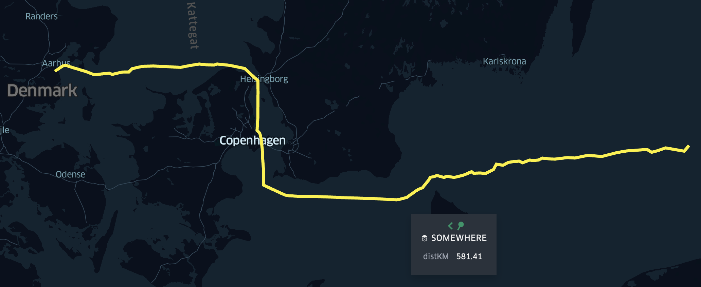

# SEA_ROUTE_CALC
This sea route calculator computes the fastest water route and its distance in KM given the LAT/LONG of a given position, to a given LAT/LONG destinination. The output file is a [GeoJSON](https://geojson.org/) (\*.geojson). This file can be displayed unsing [Kepler](kepler.gl), an opensource visualisation software developed by Uber.

An example use-case can be found [here](https://kepler.gl/demo/map?mapUrl=https://dl.dropboxusercontent.com/s/s3vfyjw6kajn8ez/keplergl_t9mztr3.json).

This repo is based on [SeaRoute](https://github.com/eurostat/searoute) which requires Java 1.9 or higher. Run `java --version` to check if Java is installed and what is the current version.

Examples of executions for windows users are provided in `searoute.bat` (for linux users, see `searoute.sh`). `test_input.csv` is an example of input file. It is a simple CSV file with origin/destination coordinates of the routes. Note that only geographical coordinates (decimal degrees) are supported. 

Run `java -jar searoute.jar -h` to see the help which describes everything you need to know.
